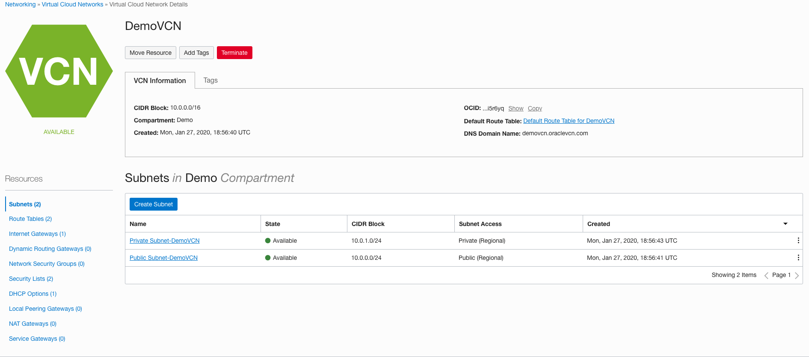
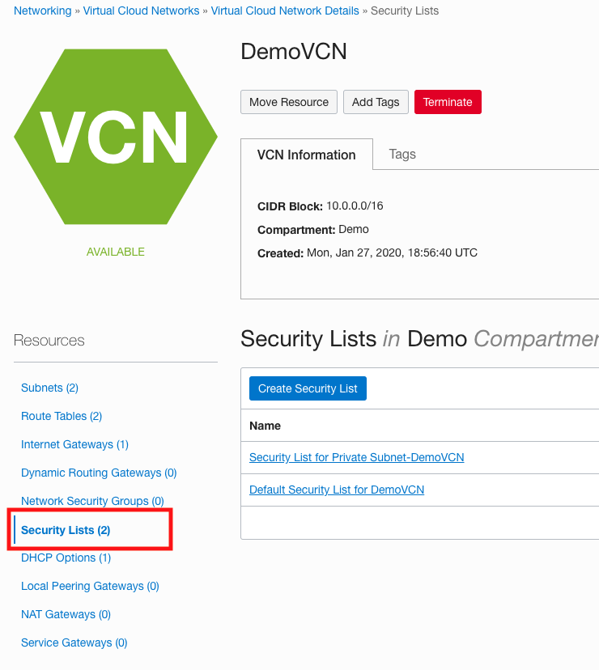

# Docker Workshop - Trial Account Set Up


## Overview

## Introduction
In this lab we will obtain an Oracle Cloud Free Tier Account (if you haven't obtained one already please [follow these directions](Intro.md)), create SSH key pairs, login to your Cloud Account, create a VCN (Virtual Compute Network) and Compartment, create a new Compute instance, and finally install Docker into the instance.

***To log issues***, click here to go to the [github oracle](https://github.com/oracle/learning-library/issues/new) repository issue submission form.

## Objectives

- Obtain an Oracle Cloud Free Tier Account
- Create the baseline infrastructure to support a Compute instance
- Create a SSH key pair
- SSH into the instance: Install Docker and Git

# Login to your new Oracle Cloud Account and Create Infrastructure

You will create all required infrastructure components within your Oracle Cloud Free Tier account.

## Your Oracle Cloud Free Tier Account

### **STEP 2**: Log in to your account

- Once you receive the **Your Cloud Account is fully provisioned** Email, make note of your **Username and Cloud Account Name**. *`Note: Usernames are usually your email address.`* You can login by clicking the Sign In button or access it from any browser.

  

- From any browser go to oracle.com to access our Cloud.

  [https://www.oracle.com/](https://www.oracle.com/)

  

- Click the icon in the upper right corner.  Click on **Sign in to Cloud** at the bottom of the drop down.  *NOTE:  Do NOT click the Sign-In button, this will take you to Single Sign-On, not the Oracle Cloud*

      

- Enter your **Cloud Account Name** in the input field and click the **My Services** button. If you have a Free Tier account provisioned, this can be found in your welcome email. Otherwise, this will be supplied by your workshop instructor.

    

- Enter your **Username** and **Password** in the input fields and click **Sign In**.

   

  **NOTE**: You will likely be prompted to change the temporary password listed in the welcome email. In that case, enter the new password in the password field.

### **STEP 3**: Create a Compartment

Compartments are used to isolate resources within your OCI tenant. User-based access policies can be applied to manage access to compute instances and other resources within a Compartment.

- Click the **hamburger icon** in the upper left corner to open the navigation menu. Under the **Identity** section of the menu, click **Compartments**

   

- Click **Create Compartment**

   

- In the **Name** field, enter any name you want. For this example we will be using the name `Demo` going forward. Enter a **Description** of your choice. Click **Create Compartment**.

  

- In a moment, your new Compartment will show up in the list.

   

### **STEP 4**: Create a Virtual Cloud Network

We need a default VCN to define our networking within the `Demo` compartment or the name you used for your compartment. This is where Subnets and Security Lists, to name a couple get defined for each Availablity Domains in your Tenancy. Oracle Cloud Infrastructure is hosted in regions and availability domains. A region is a localized geographic area, and an availability domain is one or more data centers located within a region. A region is composed of several availability domains. Availability domains are isolated from each other, fault tolerant, and very unlikely to fail simultaneously. Because availability domains do not share infrastructure such as power or cooling, or the internal availability domain network, a failure at one availability domain is unlikely to impact the availability of the others.

All the availability domains in a region are connected to each other by a low latency, high bandwidth network, which makes it possible for you to provide high-availability connectivity to the Internet and customer premises, and to build replicated systems in multiple availability domains for both high-availability and disaster recovery.

- Click the **hamburger icon** in the upper left corner to open the navigation menu. Under the **Networking** section of the menu, click **Virtual Cloud Networks**

  

- Select your compartment from the List Scope dropdown menu.

  

- Click **Networking Quickstart**, select **VCN with Internet Connectivity**, then click **Start Workflow**

  
  

- Fill in the following values as highlighted below:

  

- Click **Next**, then **Create**.

- Click **View Virtual Cloud Network**. You will see:

  

### **STEP 5**: Add a Security List entry

A security list provides a virtual firewall for an instance, with ingress and egress rules that specify the types of traffic allowed in and out. Each security list is enforced at the instance level. However, you configure your security lists at the subnet level, which means that all instances in a given subnet are subject to the same set of rules. The security lists apply to a given instance whether it's talking with another instance in the VCN or a host outside the VCN.

- In the DockerVCN network click on **Security Lists**

  

- Click on **Default Security List for DockerVCN**

  

For the purposes of the upcoming Docker deployments we need to add five Ingress Rules that allow access from the Internet to ports 9080, 8002, 18002, 5600, and 8085. In a production environment only the UI port (8085) would typically be opened for access but the labs will have us test various other Application and Oracle centric functionality as we go, thus the need to open other ports.

- Click **Add Ingress Rule**

  **`NOTE: DO NOT EDIT AN ALREADY EXISTING RULE, ADD NEW ONES...`**

  

- In the Pop up dialog **Enter the following** and then click the **Add Ingress Rule** button.

  **NOTE: Leave all other values at default. The destination port values should not have any spaces between them.**

  ```
  Source CIDR: 0.0.0.0/0
  Destination Port Range: 8085,9080,8002,18002,5600
  ```

  

- **If the comma-separated values do not work or give you `invalid input`, you will have to create the ingress rule entries one-by-one.**

- When completed your Ingress Rules should look like:

  

**This completes the Set Up!**

**You are ready to proceed to [Lab 100](Linux100.md)**
