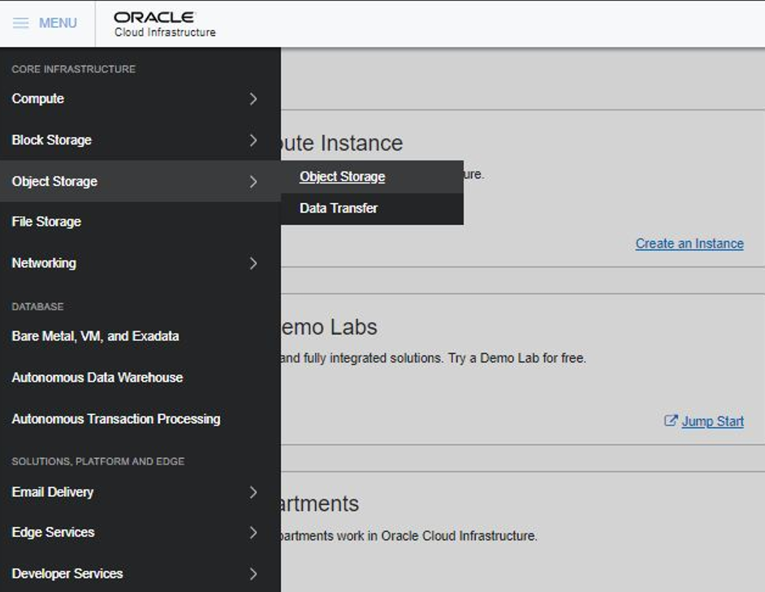
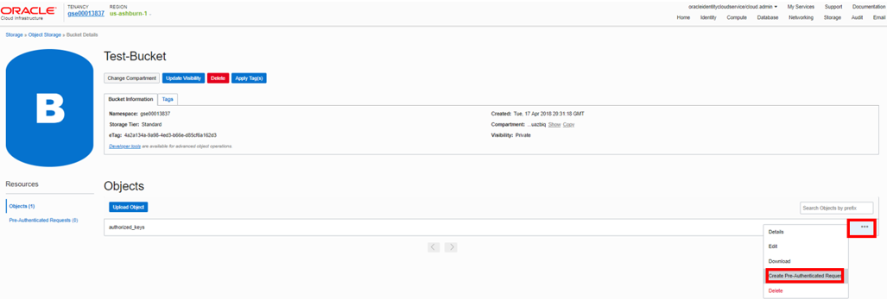
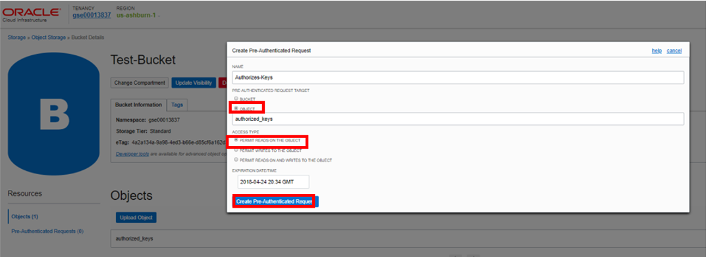
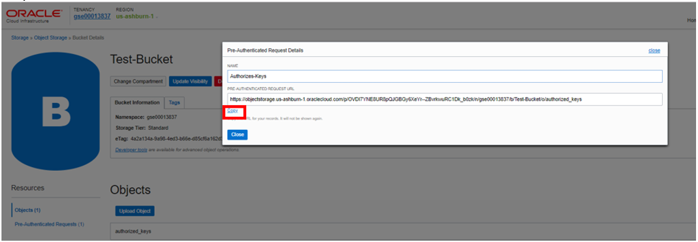
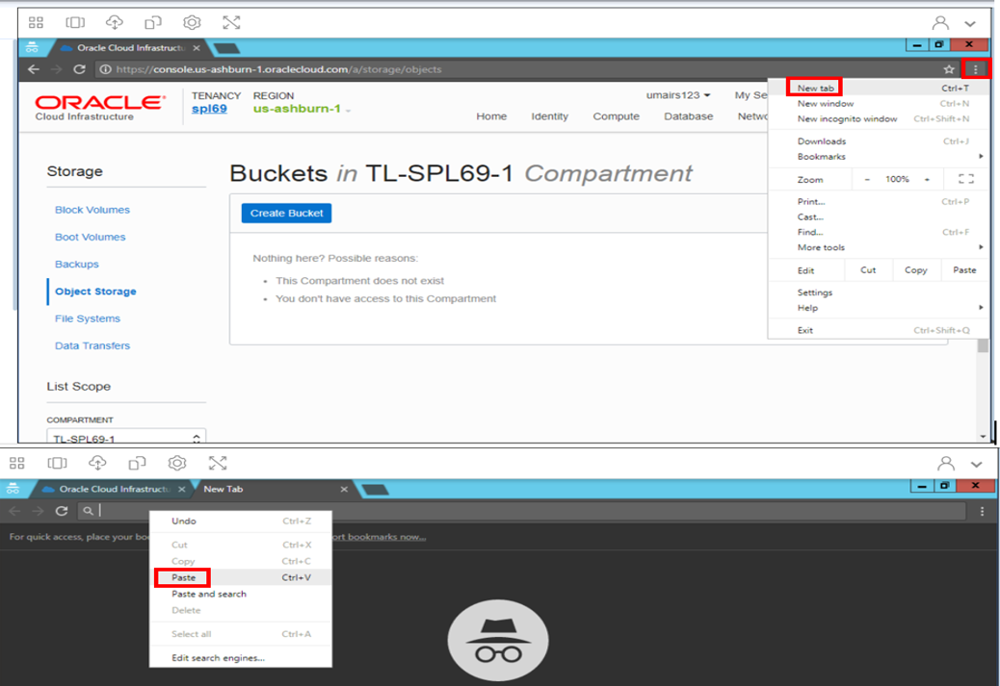
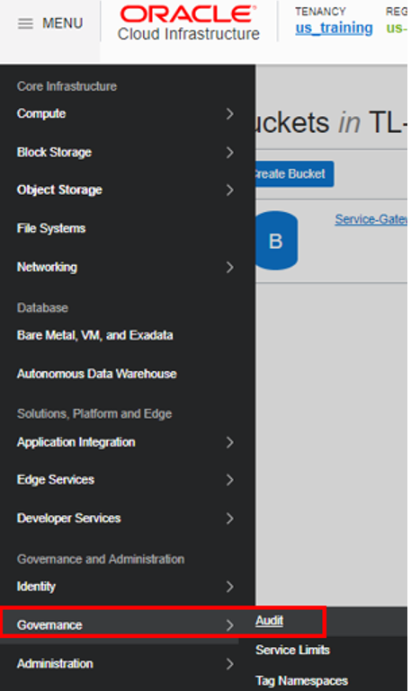

# 02 - Audit: Object Storage & Audit
  
## Table of Contents

[Overview](#overview)

[Pre-Requisites](#pre-requisites)

[Practice-1: Sign in to OCI Console and Create Object Storage Bucket](#practice-1-sign-in-to-oci-console-and-create-object-storage-bucket)

[Practice-2: Upload Object](#practice-2-upload-object)

[Practice-3: Check Audit logs](#practice-3-check-audit-logs)

## Overview

The Oracle Cloud Infrastructure Audit service automatically records calls to all supported Oracle Cloud Infrastructure public application programming interface (API) endpoints as log events. Currently, all services support logging by Audit. Object Storage service supports logging for bucket-related events, but not for object-related events. Log events recorded by the Audit service include API calls made by the Oracle Cloud Infrastructure Console, Command Line Interface (CLI), Software Development Kits (SDK), your own custom clients, or other Oracle Cloud Infrastructure services

Each log event includes a header ID, target resource(s), time stamp of the recorded event, request parameters, and response parameters. You can view events logged by the Auditservice by using the Console,API, or the Java SDK. You can view events, copy the details of individual events, as well as analyze events or store them separately. Data from events can be used to perform diagnostics, track resource usage, monitor compliance, and collect security-related events.

The purpose of this lab is to give you an overview of the Audit Service and an example scenario to help you understand how the service works.

**Note:** *Some of the UIs might look a little different than the screen shots included in the instructions, but you can still use the instructions to complete the hands-on labs.*

## Pre-Requisites

- Oracle Cloud Infrastructure account credentials (User, Password, and Tenant) 
- To sign in to the Console, you need the following:
  -  Tenant, User name and Password
  -  URL for the Console: [https://console.us-phoenix-1.oraclecloud.com/](https://console.us-phoenix-1.oraclecloud.com/)
  -  Oracle Cloud Infrastructure supports the latest versions of Google Chrome, Firefox and Internet Explorer 11 


## Practice-1: Sign in to OCI Console and Create Object Storage Bucket

1. Sign in using your tenant name, user name and password.

2. Once signed in select the compartment assigned to you from drop down menu on left part of the screen

3. From the OCI Services menu,click **Object Storage** then **Create Bucket**

**NOTE:** Ensure the correct Compartment is selected under COMPARTMENT list



4. Fill out the dialog box:
- **Bucket Name:** Provide a name (Test-Bucket in this lab)
- **Storage Tier:**  STANDARD 

5. Click **Create Bucket**


## Practice-2: Upload Object

1. Open a terminal window.

2. Change directory to the Downloads folder Enter command: 
```
cd /Downloads
```

3. Create a sample file, Enter command:
```
touch samplefile
```
This should create a file by the name"samplefile" in the Downloads folder

4. Switch to OCI window and click the Bucket Name.


5. Bucket detail window should be visible. Click **Upload Object**


6. Click on Upload Object > Browse > This PC > Downloads. You should see the sample file created earlier

7. Select the file, then click **Upload Object** in the Dialog box.

8. File should be visible under Objects. Click 
Action icon and click **Create Pre-
Authenticated Request**. This will create a web
link that can be used to access the object 
Without requiring any additional authentication.



9. Fill out the dialog box:

- NAME: Use an easy to remember name.

- PRE AUTHENTICATION REQUEST TARGET: OBJECT

- ACCESS TYPE: PERMIT READS ON THE OBJECT

- EXPIRATION DATE/TIME: Specify link expiration date

10. Click **Create Pre-Authenticated Request**



11. Click **Copy** to copy the link

**NOTE:** The link must be copied and saved once the window is closed the link can not be retrieved again. 

12. Click **Close**


13. Open a new browser window and paste Pre-Authenticated link. 


14.  An option to download the file will appear.

**NOTE:** Do NOT download the file as due to space restrictions it is not allowed for the purpose of this lab.

***You have uploaded an object to Object Storage bucket, created a pre-authenticated link and successfully accessed the object. The Pre-Authenticated link can be shared with 
other users to provide them access to the object.
Multiple objects of any size can be uploaded to the bucket and shared across teams/users.***

## Practice-3: Check Audit logs

1. In OCI services menu, Click **Audit** under Governance. Scroll down or type the bucket name in 
Keyword section. You can choose other options
such as dates and Request Action Type. For this 
lab we will leave them as default. Audit logs for the Storage bucket should be visible




***You have utilized OCI’s Audit service to extract events specific to Storage bucket created. Audit service can be used to monitor operations performed on OCI resources and can assist in trouble 
shooting your OCI environment***
