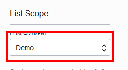

# 03 - Networking: Setting up VCN

## Introduction
In this lab we will obtain an Oracle Cloud Free Tier Account (if you haven't obtained one already please [follow these directions](Intro.md)), create a VCN (Virtual Compute Network) and Compartment

## Objectives

- Create VCN

# Login to your new Oracle Cloud Account and Create Infrastructure

You will create all required infrastructure components within your Oracle Cloud Free Tier account.

## Your Oracle Cloud Free Tier Account

### Create a Virtual Cloud Network

We need a default VCN to define our networking within the `Demo` compartment or the name you used for your compartment. This is where Subnets and Security Lists, to name a couple get defined for each Availablity Domains in your Tenancy. Oracle Cloud Infrastructure is hosted in regions and availability domains. A region is a localized geographic area, and an availability domain is one or more data centers located within a region. A region is composed of several availability domains. Availability domains are isolated from each other, fault tolerant, and very unlikely to fail simultaneously. Because availability domains do not share infrastructure such as power or cooling, or the internal availability domain network, a failure at one availability domain is unlikely to impact the availability of the others.

All the availability domains in a region are connected to each other by a low latency, high bandwidth network, which makes it possible for you to provide high-availability connectivity to the Internet and customer premises, and to build replicated systems in multiple availability domains for both high-availability and disaster recovery.

- Click the **hamburger icon** in the upper left corner to open the navigation menu. Under the **Networking** section of the menu, click **Virtual Cloud Networks**

  

- Select your compartment from the List Scope dropdown menu.

  

- Click **Networking Quickstart**, select **VCN with Internet Connectivity**, then click **Start Workflow**

  
  

- Fill in the following values as highlighted below:

  

- Click **Next**, then **Create**.

- Click **View Virtual Cloud Network**. You will see:

  
  
- Click on your newly created VCN, it will take you to this page. On the left side, you're able to see all the resources that were automatically created. Feel free to click around to look at your resources.

### **STEP 5**: Adding a Security List entry

A security list provides a virtual firewall for an instance, with ingress and egress rules that specify the types of traffic allowed in and out. Each security list is enforced at the instance level. However, you configure your security lists at the subnet level, which means that all instances in a given subnet are subject to the same set of rules. The security lists apply to a given instance whether it's talking with another instance in the VCN or a host outside the VCN.

[Lab 04 - Load Balancer](https://github.com/jgkwak/learning-library/blob/master/workshops/general/04%20-%20Load%20Balancer:%20Load%20Balancer%20%26%20Compute.md)
Will go over the steps on how to add a Security List.

**[Go back to the list of labs](https://github.com/jgkwak/learning-library/blob/master/workshops/general/README.md)**
